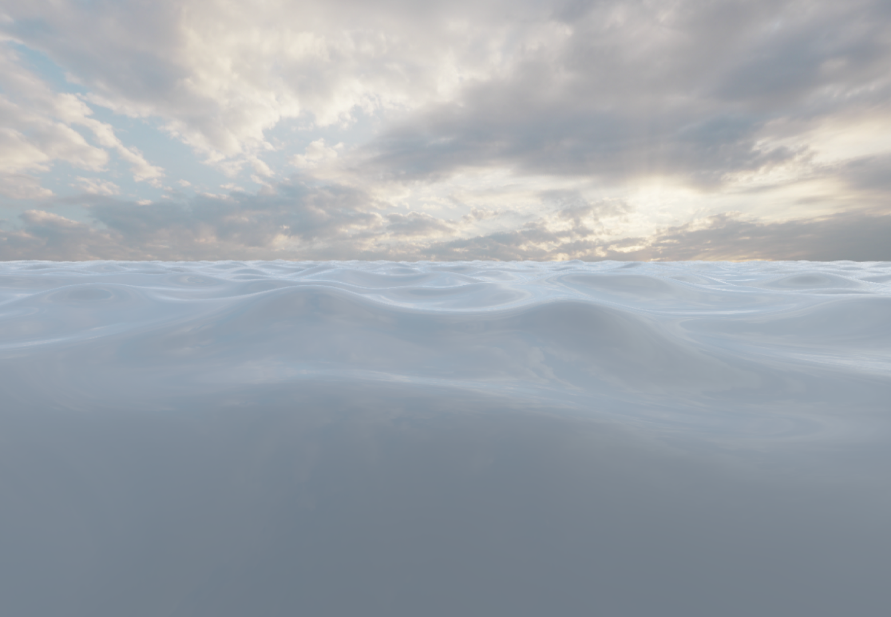
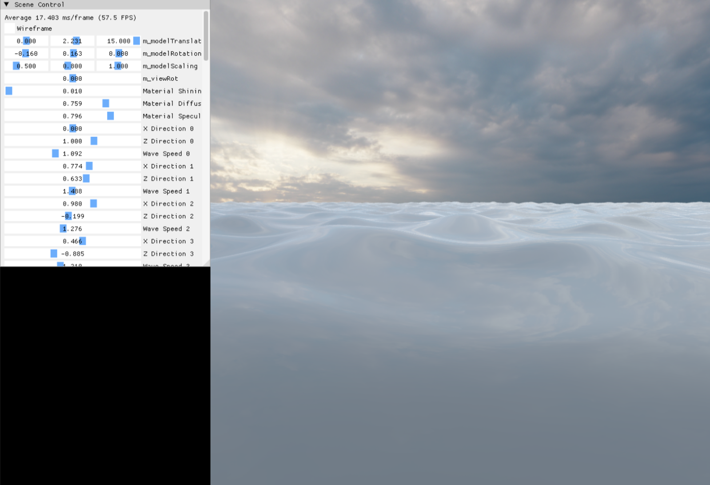

# Sin wave water

by Jaeik Choi

https://www.youtube.com/watch?v=c8QT1N8kkbA

## Goal
To build a fake water simulation using the sum of sine waves, and to apply as many computer graphics concepts I have studied so far into a practical experiment.

## Tools & Languages
- C++ - Core logic implementation
- DirectX 11 - Rendering Pipeline
- HLSL - Shader Programming
- ImGUI - Runtime visualization and control

## Features

- Sum of sines 
    - Sine wave
    - Exponential sin wave
    - FBM, Domain warping
- Basic atmosphere
    - Distance fog
    - Skybox CubeMap animation
- Basic water pixel shader
    - Frestnel equation
    - Image based lighting (IBL)
    - Blinn Phong

## Core Logic
A single sine wave was implemented through three stages.

First, a basic wave animation was created by applying frequency and time * ¥õ to the sine function. Here, ¥õ = speed ¡¿ frequency, which represents the speed of the wave.

Next, to express the effect of the wave surging upward, the sine function was transformed into an exponential function. The exponential curve resembles the cycle of a wave rising sharply and then flattening out, which is why the exponential function was adopted.

To prevent the peak of the exponential function from rising too sharply depending on the amplitude, I incorporated characteristics of fractional Brownian motion (fBM). As the sine waves are generated, the amplitude gradually decreases while the frequency increases, creating smaller waves that ripple more frequently.

Finally, to simulate the effect of waves pushing against each other, domain warping was applied.

## What I Learned
- Deeper understanding of the GPU Rendering Pipeline.
- Shader debugging with RenderDoc.
- Mathematical modeling for realistic water simulation.

## Limitations & Future work
- Current shading only supports Blinn-Phong; couldn¡¯t integrate IBL fully.
- Small ripples¡¯ amplitude is too weak, reducing realism.
- CubeMap movement is not yet linked to wave lighting variation.

## Reference
https://youtu.be/PH9q0HNBjT4?feature=shared
https://www.shadertoy.com/view/MdXyzX
https://developer.nvidia.com/gpugems/gpugems/part-i-natural-effects/chapter-1-effective-water-simulation-physical-models
https://www.honglab.ai/courses/graphicspt2